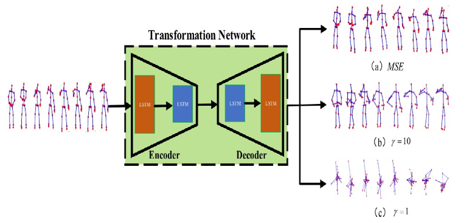
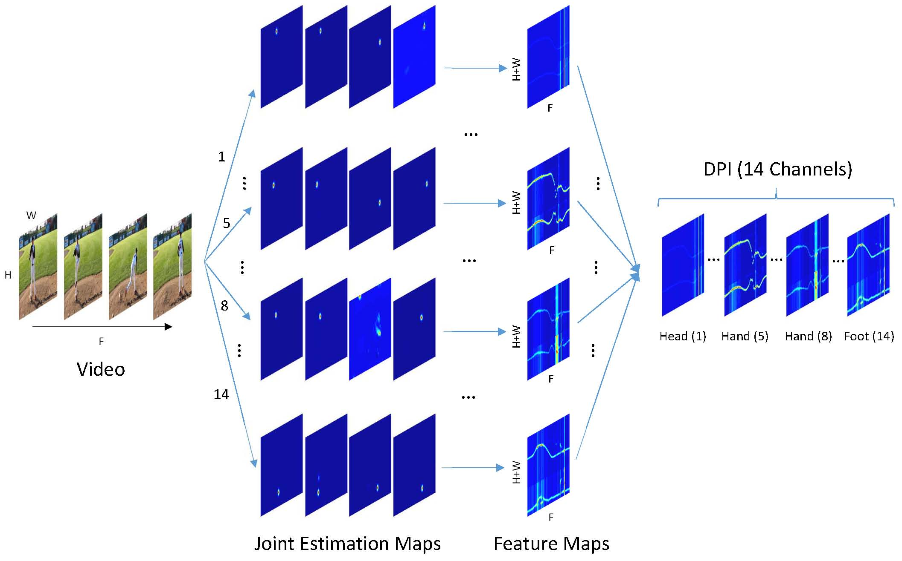
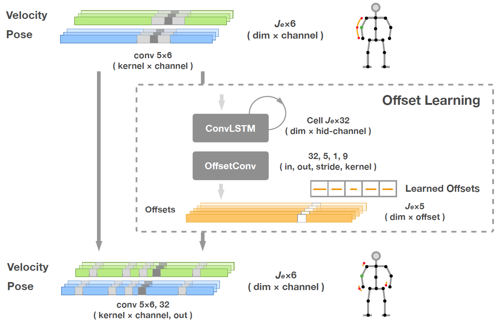
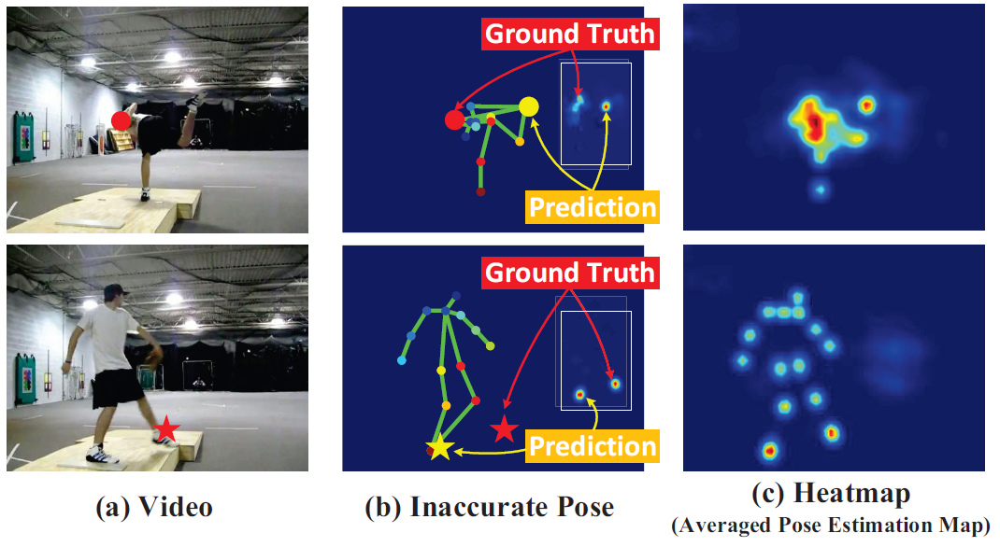
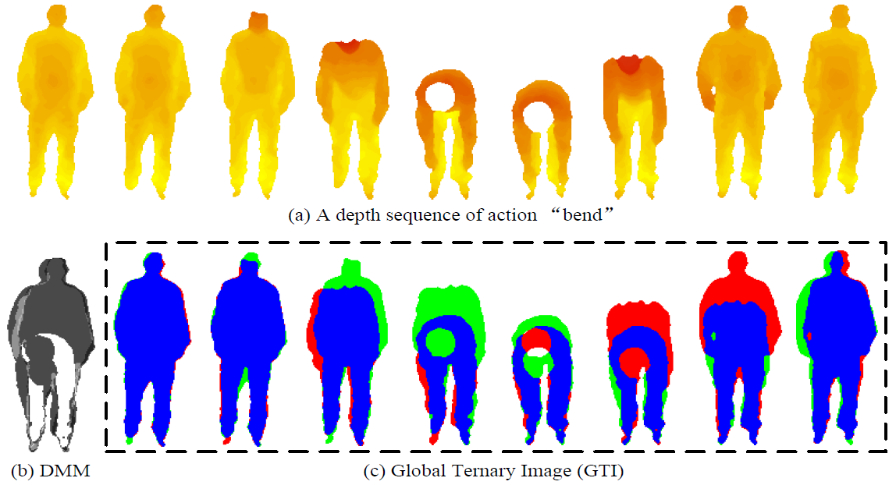
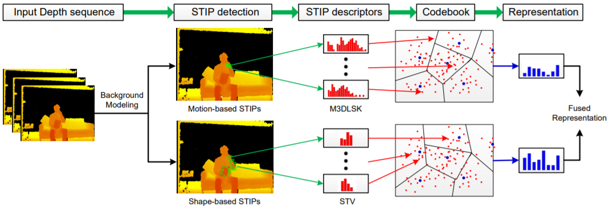
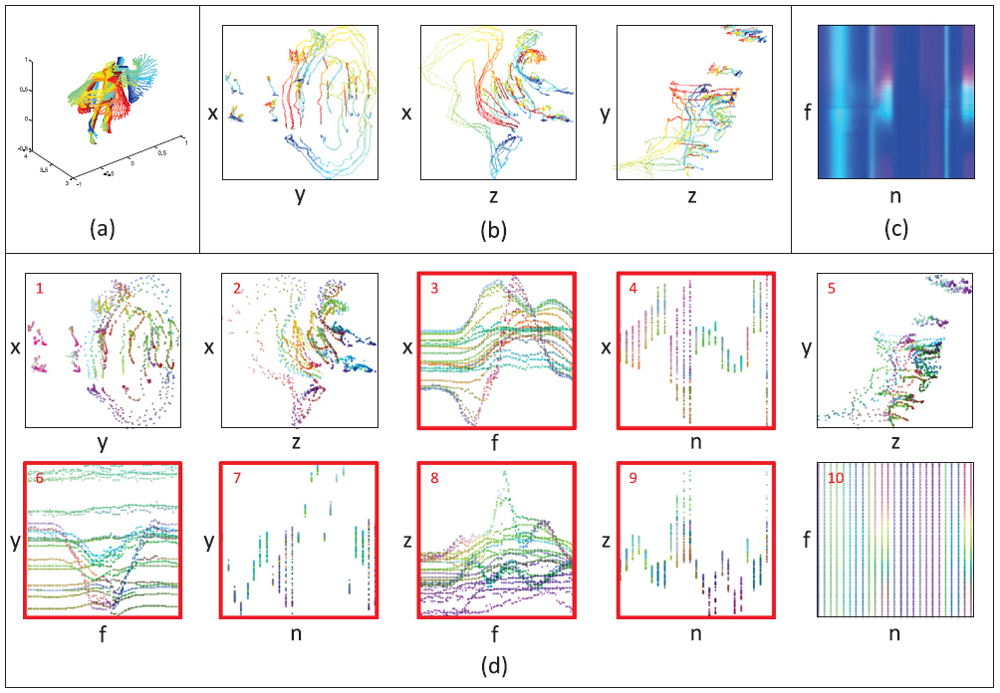
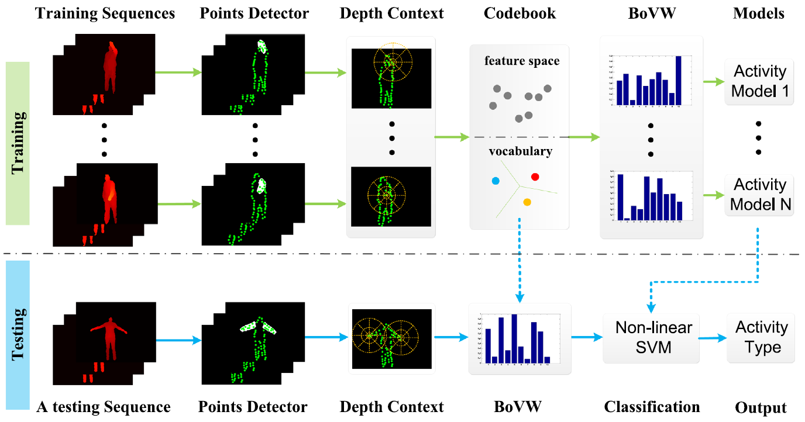
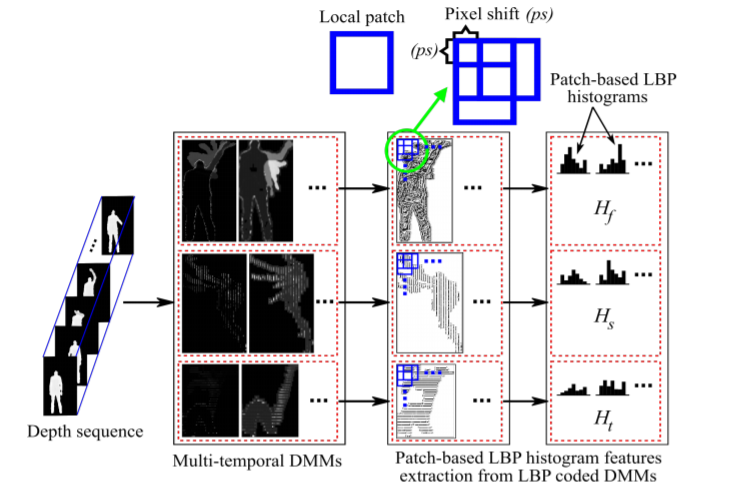

For those interested in numbers, see Mengyuan Liu's [google scholar citations profile](https://scholar.google.com/citations?user=MiFqJGcAAAAJ](https://xs.dailyheadlines.cc/citations?user=woX_4AcAAAAJ&hl=zh-CN&oi=ao).

### 2021

<!-- Begin of a paper -->
                

                  <table>
                    <tr>
                        <td>
                          
                        </td>
                        <td class="paper">
                            <b>Sample Fusion Network: An End-to-End Data Augmentation Network for Skeleton-based Human Action Recognition</b> 
                            Fanyang Meng, Hong Liu, Yongsheng Liang, Juanhui Tu, <strong>Mengyuan Liu</strong> 
                            <i>IEEE Transactions on Image Processing(<b>TIP</b>), 2019</i> 
                            [<a href = "papers/TIP2019.pdf" target="_blank">Paper</a>]
                            [<a href = "https://github.com/nkliuyifang/Sample-Fusion-Network" target="_blank">Code</a>]
                            [<a href="javascript:toggle_visibility('TIP2019')">BibTeX</a>]
                            <pre id="TIP2019"  xml:space="preserve" style="display: none;">
@inproceedings{TIP2019,
    title={Sample Fusion Network: An End-to-End Data Augmentation Network for Skeleton-based Human Action Recognition},
    author={Meng, Fanyang and Liu, Hong and Liang, Yongsheng and Tu, Juanhui and Liu, Mengyuan},
    journal={IEEE Transactions on Image Processing (T-IP)},
    year={2019}
}</pre>
                       
                        </td>
                    </tr>
                  </table>
                

                <!-- End of a paper -->
                    
                                    <!-- Begin of a paper -->
                

                  <table>
                    <tr>
                        <td>
                          
                        </td>
                        <td class="paper">
                            <b>Joint Dynamic Pose Image and Space Time Reversal for Human Action Recognition from Videos</b> 
                            <strong>Mengyuan Liu</strong>, Fanyang Meng, Chen Chen, Songtao Wu 
                            <i>AAAI Conference on Artificial Intelligence (<b>AAAI</b>), 2019 (oral)</i> 
                            [<a href = "papers/AAAI2019.pdf" target="_blank">Paper</a>]
                            [<a href = "images/AAAI2019.mp4" target="_blank">Video</a>]
                            [<a href="javascript:toggle_visibility('AAAI2019')">BibTeX</a>]
                            <pre id="AAAI2019"  xml:space="preserve" style="display: none;">
@inproceedings{AAAI2019,
    title = {Joint Dynamic Pose Image and Space Time Reversal for Human Action Recognition from Videos},
    author = {Liu, Mengyuan and Meng, Fanyang and Chen, Chen and Wu, Songtao},
    booktitle = {AAAI Conference on Artificial Intelligence (AAAI)},
    year = {2019}
}</pre>
                        </td>
                    </tr>
                  </table>
                

                <!-- End of a paper -->
        
        
        

                <!-- Begin of a paper -->
                

                  <table>
                    <tr>
                        <td>
                          
                        </td>
                        <td class="paper">
                            <b>Deformable Pose Traversal Convolution for 3D Action and Gesture Recognition</b> 
                            Junwu Weng, <strong>Mengyuan Liu</strong>, Xudong Jiang, Junsong Yuan 
                            <i>Europen Conference on Computer Vision (<b>ECCV</b>), 2018</i> 
                            [<a href = "papers/ECCV2018.pdf" target="_blank">Paper</a>]
                            [<a href="javascript:toggle_visibility('ECCV2018')">BibTeX</a>]
                            <pre id="ECCV2018"  xml:space="preserve" style="display: none;">
@inproceedings{ECCV2018,
    title = {Deformable Pose Traversal Convolution for 3D Action and Gesture Recognition},
    author = {Weng, Junwu and Liu, Mengyuan and Jiang, Xudong and Yuan, Junsong},
    booktitle = {Europen Conference on Computer Vision (ECCV)},
    year = {2018}
}</pre>
                        </td>
                    </tr>
                  </table>
                

                <!-- End of a paper -->

                
                <!-- Begin of a paper -->
                

                  <table>
                    <tr>
                        <td>
                          
                        </td>
                        <td class="paper">
                            <b>Recognizing Human Actions as the Evolution of Pose Estimation Maps</b> 
                            <strong>Mengyuan Liu</strong>, Junsong Yuan 
                            <i>International Conference on Computer Vision and Pattern Recognition (<b>CVPR</b>), 2018</i> 
                            [<a href = "papers/CVPR2018.pdf" target="_blank">Paper</a>]
                            [<a href = "papers/CVPR2018_poster.pdf" target="_blank">Poster</a>]
                            [<a href = "codes/CVPR2018_code.zip" target="_blank">Code</a>]
                            [<a href="javascript:toggle_visibility('CVPR2018')">BibTeX</a>]
                            <pre id="CVPR2018"  xml:space="preserve" style="display: none;">
@inproceedings{CVPR2018,
    title={Recognizing Human Actions as the Evolution of Pose Estimation Maps},
    author={Liu, Mengyuan and Yuan, Junsong},
    booktitle={IEEE Conference on Computer Vision and Pattern Recognition (CVPR)},
    pages={1159--1168},
    year={2018}  
}</pre>
                        </td>
                    </tr>
                  </table>
                

                <!-- End of a paper -->

                
                <!-- Begin of a paper -->
                

                  <table>
                    <tr>
                        <td>
                          
                        </td>
                        <td class="paper">
                            <b>3D Action Recognition using Multi-Scale Energy-based Global Ternary Image</b> 
                            <strong>Mengyuan Liu</strong>, Hong Liu, Chen Chen 
                            <i>IEEE Transactions on Circuits and Systems for Video Technology (<b>T-CSVT</b>), 2017</i> 
                            [<a href = "papers/TCSVT2017.pdf" target="_blank">Paper</a>]
                            [<a href="javascript:toggle_visibility('TCSVT2017')">BibTeX</a>]
                            <pre id="TCSVT2017"  xml:space="preserve" style="display: none;">
@article{
    title={3D action recognition using multi-scale energy-based global ternary image},
    author={Liu, Mengyuan and Liu, Hong and Chen, Chen},
    journal={IEEE Transactions on Circuits and Systems for Video Technology (T-CSVT)},
    year={2017}
}</pre>
                        </td>
                    </tr>
                  </table>
                

                <!-- End of a paper -->

                <!-- Begin of a paper -->
                

                  <table>
                    <tr>
                        <td>
                          
                        </td>
                        <td class="paper">
                            <b>Robust 3D Action Recognition through Sampling Local Appearances and Global Distributions</b> 
                            <strong>Mengyuan Liu</strong>, Hong Liu, Chen Chen 
                            <i>IEEE Transactions on Multimedia (<b>T-MM</b>), 2017</i> 
                            [<a href = "papers/TMM2017.pdf" target="_blank">Paper</a>]
                            [<a href="javascript:toggle_visibility('TMM2017')">BibTeX</a>]
                            <pre id="TMM2017"  xml:space="preserve" style="display: none;">
@article{
    title={Robust 3D Action Recognition through Sampling Local Appearances 
    and Global Distributions},
    author={Liu, Mengyuan and Liu, Hong and Chen, Chen},
    journal={IEEE Transactions on Multimedia (T-MM)},
    year={2017}
}</pre>
                        </td>
                    </tr>
                  </table>
                

                <!-- End of a paper -->

                <!-- Begin of a paper -->
                

                  <table>
                    <tr>
                        <td>
                          
                        </td>
                        <td class="paper">
                            <b>Enhanced Skeleton Visualization for View Invariant Human Action Recognition</b> 
                            <strong>Mengyuan Liu</strong>, Hong Liu, Chen Chen 
                            <i>Pattern Recognition (<b>PR</b>), 2017</i> 
                            [<a href = "papers/PR2017.pdf" target="_blank">Paper</a>]
                            [<a href="javascript:toggle_visibility('PR2017')">BibTeX</a>]
                            <pre id="PR2017"  xml:space="preserve" style="display: none;">
@article{
    title={Enhanced skeleton visualization for view invariant human action recognition},
    author={Liu, Mengyuan and Liu, Hong and Chen, Chen},
    journal={Pattern Recognition (PR)},
    volume={68},
    pages={346--362},
    year={2017}
}</pre>
                        </td>
                    </tr>
                  </table>
                

                <!-- End of a paper -->

                <!-- Begin of a paper -->
                

                  <table>
                    <tr>
                        <td>
                          
                        </td>
                        <td class="paper">
                            <b>Depth Context: A New Descriptor for Human Activity Recognition by using Sole Depth Sequences</b> 
                            <strong>Mengyuan Liu</strong>, Hong Liu 
                            <i>Neurocomputing, 2016</i> 
                            [<a href = "papers/NC2016.pdf" target="_blank">Paper</a>]
                            [<a href="javascript:toggle_visibility('NC2016')">BibTeX</a>]
                            <pre id="NC2016"  xml:space="preserve" style="display: none;">
@article{
    title={Depth Context: A new descriptor for human activity recognition 
    by using sole depth sequences},
    author={Liu, Mengyuan and Liu, Hong},
    journal={Neurocomputing},
    volume={175},
    pages={747--758},
    year={2016}
}</pre>
                        </td>
                    </tr>
                  </table>
                

                <!-- End of a paper -->

                <!-- Begin of a paper -->
                

                  <table>
                    <tr>
                        <td>
                          
                        </td>
                        <td class="paper">
                            <b>3D Action Recognition Using Multi-temporal Depth Motion Maps and Fisher Vector</b> 
                            Chen Chen*, <strong>Mengyuan Liu*</strong>, Baochang Zhang, Jungong Han, Junjun Jiang, and Hong Liu 
                            <i>International Joint Conference on Artificial Intelligence (<b>IJCAI</b>), 2016</i> 
                            [<a href = "papers/IJCAI2016.pdf" target="_blank">Paper</a>]
                            [<a href="javascript:toggle_visibility('IJCAI2016')">BibTeX</a>]
                            <pre id="IJCAI2016"  xml:space="preserve" style="display: none;">
@article{
    title={3D Action Recognition Using Multi-Temporal Depth Motion Maps and Fisher Vector.},
    author={Chen, Chen and Liu, Mengyuan and Zhang, Baochang and Han, 
    Jungong and Jiang, Junjun and Liu, Hong},
    booktitle={International Joint Conference on Artificial Intelligence (IJCAI)},
    pages={3331--3337},
    year={2016}
}</pre>
                        </td>
                    </tr>
                  </table>
                

                <!-- End of a paper -->

            

        

    </body>
</html>
